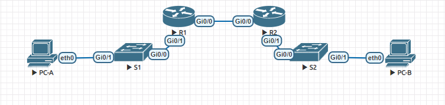

#  Реализация DHCPv4
## Задание:
1.  Создание сети и настройка основных параметров устройства
2.  Настройка и проверка двух серверов DHCPv4 на R1
3.  Настройка и проверка DHCP Relay на R2
## Топология:

## Решение: 
### Создание сети и настройка основных параметров устройства
####  Создание схемы адресации
- Таблица адресации: 

|  				Device 			 |   				Interface 			  |  				IP Address 			 |    				Subnet Mask 			   |  				Default Gateway 			 |
|:--------:|:-------------:|:------------:|:-----------------:|:-----------------:|
|  				R1 			     |  				G0/0 			      |  				10.0.0.1 			   |  				255.255.255.252 			 |  				N/A 			             |
|  				R1 			     |  				G0/1 			      |  				N/A 			        |  				N/A 			             |  				N/A 			             |
|  				R1 			     |  				G0/1.100 			  | 192.168.1.1  | 255.255.255.192   |  				N/A 			             |
|  				R1 			     |  				G0/1.200 			  | 192.168.1.65 | 255.255.255.224   |  				N/A 			             |
|  				R1 			     |  				G0/1.1000 			 |  				N/A 			        |  				N/A 			             |  				N/A 			             |
|  				R2 			     |  				G0/0 			      |  				10.0.0.2 			   |  				255.255.255.252 			 |  				N/A 			             |
|  				R2 			     |  				G0/1 			      | 192.168.1.97 | 255.255.255.240   |  				N/A 			             |
|  				S1 			     |  				VLAN 200 			    | 192.168.1.66 | 255.255.255.224   | 192.168.1.65      |
|  				S2 			     |  				VLAN 1 			      | 192.168.1.98 | 255.255.255.240   | 192.168.1.97      |
|  				PC-A 			   |  				NIC 			         |  				DHCP 			       |  				DHCP 			            |  				DHCP 			            |
|  				PC-B 			   |  				NIC 			         |  				DHCP 			       |  				DHCP 			            |  				DHCP 			            |

- Таблица VLAN:

|  					VLAN 				 |      					Name 				    |  					Interface Assigned 				 |
|:------:|:-------------:|:--------------------:|
|  					1 				    |  					N/A 				         |  					S2: G0/1 				          |
|  					100 				  |  					Clients 				     |  					S1: G0/1 				          |
|  					200 				  |  					Management 				  |  					S1: VLAN 200  					 				     |
|  					999 				  |  					Parking_Lot 				 |  					S1: Et0/1, Et0/2 				   |
|  					1000 				 |  					Native 				      |  					N/A 				                |


#### Настройка маршрутизаторов

- R1
```
Router>en
Router#conf t
Router(config)#host R1
R1(config)#no ip domain-lookup
R1(config)#service password-encryption 
R1(config)#ena sec class
R1(config)#line con 0
R1(config-line)#password cisco
R1(config-line)#logging synchronous 
R1(config-line)#login
R1(config-line)#line vty 0 4
R1(config-line)#password cisco
R1(config-line)#login
R1(config-line)#exit
R1(config)#banner #
Enter TEXT message.  End with the character '#'.
!!!!!!!!!!!!!!!!!!!!!!!!!!!!!!!!!!!!!!!
!!      Only authorized access!      !!   
!!!!!!!!!!!!!!!!!!!!!!!!!!!!!!!!!!!!!!!
#
R1(config)#end
R1#clock set 00:05:00 29 Mar 2021
R1#copy run start
Destination filename [startup-config]? 
Building configuration...
[OK]
R1#
```
- R2
```
Настройки выполнены аналогично
```
### Настраиваем на роутерах адреса и подынтерфейсы
- R1
```
R1(config)#int gi0/1 
R1(config-if)#no sh
R1(config-if)#des S1
R1(config-subif)#int gi0/1.100
R1(config-subif)#des Clients
R1(config-subif)#enc dot1q 100
R1(config-subif)#ip add 192.168.1.1 255.255.255.192
R1(config-subif)#int gi0/1.200
R1(config-subif)#des Mgmt
R1(config-subif)#enc dot1q 200
R1(config-subif)#ip add 192.168.1.65 255.255.255.224
R1(config-subif)#int gi0/1.1000                     
R1(config-subif)#des Dummy_native
R1(config-subif)#int gi0/0
R1(config-if)#des R2
R1(config-if)#ip add 10.0.0.1 255.255.255.252
R1(config-if)#no sh
R1(config-if)#exit
R1(config)#ip route 0.0.0.0 0.0.0.0 10.0.0.2 
R1(config)#
```
- R2
```
R2(config)#int gi0/1 
R2(config-if)#no sh
R2(config-if)#des S2
R2(config-if)#ip add 192.168.1.97 255.255.255.240
R2(config-if)#int gi0/0
R2(config-if)#no sh
R2(config-if)#des R1
R2(config-if)#ip add 10.0.0.2 255.255.255.252
R2(config-if)#exit
R2(config)#ip route 0.0.0.0 0.0.0.0 10.0.0.1
R2(config)#
```
### Проверяем работу маршрутизации
```
R1#ping 192.168.1.97
Type escape sequence to abort.
Sending 5, 100-byte ICMP Echos to 192.168.1.97, timeout is 2 seconds:
!!!!!
Success rate is 100 percent (5/5), round-trip min/avg/max = 2/2/2 ms
R1#
```
