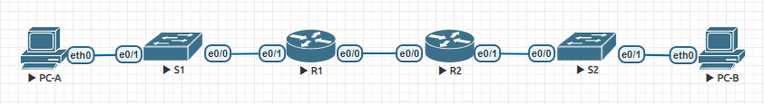
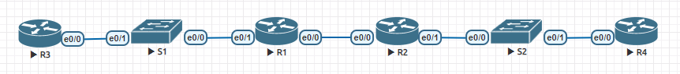

#  Настройка DHCPv6
## Задание:
1. [Создание сети и настройка основных параметров устройств](https://github.com/klyuchnikovn/net_eng/blob/master/DHCPv6.md#%D1%81%D0%BE%D0%B7%D0%B4%D0%B0%D0%BD%D0%B8%D0%B5-%D1%81%D0%B5%D1%82%D0%B8-%D0%B8-%D0%BD%D0%B0%D1%81%D1%82%D1%80%D0%BE%D0%B9%D0%BA%D0%B0-%D0%BE%D1%81%D0%BD%D0%BE%D0%B2%D0%BD%D1%8B%D1%85-%D0%BF%D0%B0%D1%80%D0%B0%D0%BC%D0%B5%D1%82%D1%80%D0%BE%D0%B2-%D1%83%D1%81%D1%82%D1%80%D0%BE%D0%B9%D1%81%D1%82%D0%B2)
2. [Проверка назначения адреса SLAAC от R1](https://github.com/klyuchnikovn/net_eng/blob/master/DHCPv6.md#%D0%BF%D1%80%D0%BE%D0%B2%D0%B5%D1%80%D0%BA%D0%B0-%D0%BD%D0%B0%D0%B7%D0%BD%D0%B0%D1%87%D0%B5%D0%BD%D0%B8%D1%8F-%D0%B0%D0%B4%D1%80%D0%B5%D1%81%D0%B0-slaac-%D0%BE%D1%82-r1)
3. [Настройка и проверка сервера DHCPv6 без сохранения состояния на R1](https://github.com/klyuchnikovn/net_eng/blob/master/DHCPv6.md#%D0%BD%D0%B0%D1%81%D1%82%D1%80%D0%BE%D0%B9%D0%BA%D0%B0-%D0%B8-%D0%BF%D1%80%D0%BE%D0%B2%D0%B5%D1%80%D0%BA%D0%B0-%D1%81%D0%B5%D1%80%D0%B2%D0%B5%D1%80%D0%B0-dhcpv6-%D0%B1%D0%B5%D0%B7-%D1%81%D0%BE%D1%85%D1%80%D0%B0%D0%BD%D0%B5%D0%BD%D0%B8%D1%8F-%D1%81%D0%BE%D1%81%D1%82%D0%BE%D1%8F%D0%BD%D0%B8%D1%8F-%D0%BD%D0%B0-r1)
4. [Настройка и проверка состояния DHCPv6 сервера на R1](https://github.com/klyuchnikovn/net_eng/blob/master/DHCPv6.md#%D0%BD%D0%B0%D1%81%D1%82%D1%80%D0%BE%D0%B9%D0%BA%D0%B0-%D0%B8-%D0%BF%D1%80%D0%BE%D0%B2%D0%B5%D1%80%D0%BA%D0%B0-%D1%81%D0%BE%D1%81%D1%82%D0%BE%D1%8F%D0%BD%D0%B8%D1%8F-dhcpv6-%D1%81%D0%B5%D1%80%D0%B2%D0%B5%D1%80%D0%B0-%D0%BD%D0%B0-r1)
5. [Настройка и проверка DHCPv6 Relay на R2](https://github.com/klyuchnikovn/net_eng/blob/master/DHCPv6.md#%D0%BD%D0%B0%D1%81%D1%82%D1%80%D0%BE%D0%B9%D0%BA%D0%B0-%D0%B8-%D0%BF%D1%80%D0%BE%D0%B2%D0%B5%D1%80%D0%BA%D0%B0-dhcpv6-relay-%D0%BD%D0%B0-r2)
## Решение: 
### Создание сети и настройка основных параметров устройств
####  Создадим схему адресации
- Таблица адресации: 


| Device | Interface   | IPv6 Address           |
|--------|-------------|------------------------|
| R1     | E0/0 | 2001:db8:acad:2::1 /64 |
| R1     | E0/0 | fe80::1                |
| R1     | E0/1 | 2001:db8:acad:1::1/64  |
| R1     | E0/1 | fe80::1                |
| R2     | E0/0 | 2001:db8:acad:2::2/64  |
| R2     | E0/0 | fe80::2                |
| R2     | E0/1 | 2001:db8:acad:3::1/64 |
| R2     | E0/1 | fe80::1                |
| PC-A   | NIC         | DHCP                   |
| PC-B   | NIC         | DHCP                   |
| R3    | E0/0 | DHCP                   |
| R4    | E0/0 | DHCP                   |

## Топология:

#### Настроим коммутаторы
- S1
```
Switch>en
Switch#conf t
Switch(config)#host S1
S1(config)#no ip domain-lookup
S1(config)#service password-encryption 
S1(config)#ena sec class
S1(config)#line con 0
S1(config-line)#password cisco
S1(config-line)#logging synchronous 
S1(config-line)#login
S1(config-line)#line vty 0 4
S1(config-line)#password cisco
S1(config-line)#login
S1(config-line)#exit
S1(config)#banner #
Enter TEXT message.  End with the character '#'.
!!!!!!!!!!!!!!!!!!!!!!!!!!!!!!!!!!!!!!!
!!      Only authorized access!      !!   
!!!!!!!!!!!!!!!!!!!!!!!!!!!!!!!!!!!!!!!
#
S1(config)#end
S1#clock set 14:35:00 28 Mar 2021
S1#copy run start
Destination filename [startup-config]? 
Building configuration...
[OK]
S1#
```
- S2
```
Настройки выполнены аналогично
``` 

#### Настроим маршрутизаторы
- R1
```
Router>en
Router#conf t
Router(config)#ipv6 unicast-routing
Router(config)#host R1
R1(config)#no ip domain-lookup
R1(config)#service password-encryption 
R1(config)#ena sec class
R1(config)#line con 0
R1(config-line)#password cisco
R1(config-line)#logging synchronous 
R1(config-line)#login
R1(config-line)#line vty 0 4
R1(config-line)#password cisco
R1(config-line)#login
R1(config-line)#exit
R1(config)#banner #
Enter TEXT message.  End with the character '#'.
!!!!!!!!!!!!!!!!!!!!!!!!!!!!!!!!!!!!!!!
!!      Only authorized access!      !!   
!!!!!!!!!!!!!!!!!!!!!!!!!!!!!!!!!!!!!!!
#
R1(config)#ipv6 unicast-routing
R1(config)#end
R1#clock set 00:05:00 29 Mar 2021
R1#copy run start
Destination filename [startup-config]? 
Building configuration...
[OK]
R1#
```
- R2
```
Настройки выполнены аналогично
``` 
#### Настроим интерфейсы и маршрутизацию для обоих маршрутизаторов
- R1
```
R1(config)#int e0/0
R1(config-if)#des R2
R1(config-if)#ipv6 address fe80::1 link-local
R1(config-if)#ipv6 address 2001:db8:acad:2::1/64
R1(config-if)#no sh
R1(config-if)#int e0/1
R1(config-if)#des S1
R1(config-if)#ipv6 address fe80::1 link-local
R1(config-if)#ipv6 address 2001:db8:acad:1::1/64
R1(config-if)#no sh
R1(config-if)#ipv6 route ::/0 2001:DB8:ACAD:2::2
R1(config)#do copy running-config startup-config
Destination filename [startup-config]? 
Building configuration...
[OK]
R1(config)#
```
- R2
```
R2(config)#int e0/0
R2(config-if)#des R1
R2(config-if)#ipv6 address fe80::1 link-local
R2(config-if)#ipv6 address 2001:db8:acad:2::2/64
R2(config-if)#no sh
R2(config-if)#int e0/1 
R2(config-if)#des S2
R2(config-if)#ipv6 address fe80::1 link-local
R2(config-if)#ipv6 address 2001:db8:acad:3::1/64 
R2(config-if)#no sh
R2(config-if)#ipv6 route ::/0 2001:DB8:ACAD:2::1
R2(config)#do copy running-config startup-config
Destination filename [startup-config]? 
Building configuration...
[OK]
R2(config)#
```
#### Проверим работу маршрутизации
```
R1#ping 2001:DB8:ACAD:2::2
Type escape sequence to abort.
Sending 5, 100-byte ICMP Echos to 2001:DB8:ACAD:2::2, timeout is 2 seconds:
!!!!!
Success rate is 100 percent (5/5), round-trip min/avg/max = 1/1/2 ms
R1#
```
### Проверка назначения адреса SLAAC от R1
```
VPCS> set pcname PC-A

PC-A> ip auto 
GLOBAL SCOPE      : 2001:db8:acad:1:2050:79ff:fe66:6814/64
ROUTER LINK-LAYER : aa:bb:cc:00:e0:10

PC-A> ping 2001:db8:acad:1::1

2001:db8:acad:1::1 icmp6_seq=1 ttl=64 time=0.355 ms
2001:db8:acad:1::1 icmp6_seq=2 ttl=64 time=0.596 ms
2001:db8:acad:1::1 icmp6_seq=3 ttl=64 time=0.513 ms
2001:db8:acad:1::1 icmp6_seq=4 ttl=64 time=0.578 ms
2001:db8:acad:1::1 icmp6_seq=5 ttl=64 time=0.621 ms

PC-A>
```
### Настройка и проверка сервера DHCPv6 без сохранения состояния на R1
## Топология:

#### Настроим R3 в качестве клиента DHCPv6
Базовые настройки выполнены аналогично R1
```
R3(config)#int e0/0
R3(config-if)#no sh
R3(config-if)#ipv6 en
R3(config-if)#ipv6 add au
R3(config-if)#end
R3#
```
#### Настроим R1 
```
R1#conf t
R1(config)#ipv6 dhcp pool R1-STATELESS
R1(config-dhcpv6)#dns-server 2001:db8:acad::254
R1(config-dhcpv6)#domain-name STATELESS.com
R1(config-dhcpv6)#int e0/1
R1(config-if)#ipv6 nd other-config-flag
R1(config-if)#ipv6 dhcp server R1-STATELESS
R1(config-if)#do copy run start
Destination filename [startup-config]? 
Building configuration...
[OK]
R1#
```
#### Проверим
```
R3#sh ipv6 int br
Ethernet0/0            [up/up]
    FE80::A8BB:CCFF:FE01:0
    2001:DB8:ACAD:1:A8BB:CCFF:FE01:0
Ethernet0/1            [administratively down/down]
    unassigned
Ethernet0/2            [administratively down/down]
    unassigned
Ethernet0/3            [administratively down/down]
    unassigned
R3#sh ipv6 dhcp int e0/0
Ethernet0/0 is in client mode
  Prefix State is IDLE (0)
  Information refresh timer expires in 23:56:44
  Address State is IDLE
  List of known servers:
    Reachable via address: FE80::1
    DUID: 00030001AABBCC00E000
    Preference: 0
    Configuration parameters:
      DNS server: 2001:DB8:ACAD::254
      Domain name: STATELESS.com
      Information refresh time: 0
  Prefix Rapid-Commit: disabled
  Address Rapid-Commit: disabled
R3#ping 2001:DB8:ACAD:1::1
Type escape sequence to abort.
Sending 5, 100-byte ICMP Echos to 2001:DB8:ACAD:1::1, timeout is 2 seconds:
!!!!!
Success rate is 100 percent (5/5), round-trip min/avg/max = 1/4/20 ms
R3#
```
### Настройка и проверка состояния DHCPv6 сервера на R1
```
R1(config)#ipv6 dhcp pool R2-STATEFUL
R1(config-dhcpv6)#address prefix 2001:db8:acad:3:aaa::/80
R1(config-dhcpv6)#dns-server 2001:db8:acad::254
R1(config-dhcpv6)#domain-name STATEFUL.com
R1(config-dhcpv6)#int e0/0
R1(config-if)#ipv6 dhcp server R2-STATEFUL
R1(config-if)#
```
### Настройка и проверка DHCPv6 Relay на R2
#### Настроим R4 в качестве клиента DHCPv6
Базовые настройки выполнены аналогично R1
```
R4(config)#int e0/0
R4(config-if)#no sh
R4(config-if)#ipv6 en
R4(config-if)#ipv6 add dhcp
R4(config-if)#

```
#### Настроим R2 в качестве агента DHCP relay
```
R2(config)#int e0/1
R2(config-if)#ipv6 nd managed-config-flag
R2(config-if)#ipv6 dhcp relay destination 2001:db8:acad:2::1 e0/0
R2(config-if)#do copy run start
Destination filename [startup-config]? 
Building configuration...
[OK]
R2(config-if)#
```
#### Проверим
```
R4#sh ipv6 int br
Ethernet0/0            [up/up]
    FE80::A8BB:CCFF:FE01:1000
    2001:DB8:ACAD:3:AAA:F7C9:5E2D:DDD1
Ethernet0/1            [administratively down/down]
    unassigned
Ethernet0/2            [administratively down/down]
    unassigned
Ethernet0/3            [administratively down/down]
    unassigned
R4#sh ipv6 dhcp int e0/0
Ethernet0/0 is in client mode
  Prefix State is IDLE
  Address State is OPEN
  Renew for address will be sent in 11:58:50
  List of known servers:
    Reachable via address: FE80::1
    DUID: 00030001AABBCC00E000
    Preference: 0
    Configuration parameters:
      IA NA: IA ID 0x00030001, T1 43200, T2 69120
        Address: 2001:DB8:ACAD:3:AAA:F7C9:5E2D:DDD1/128
                preferred lifetime 86400, valid lifetime 172800
                expires at Mar 30 2021 02:44 PM (172730 seconds)
      DNS server: 2001:DB8:ACAD::254
      Domain name: STATEFUL.com
      Information refresh time: 0
  Prefix Rapid-Commit: disabled
  Address Rapid-Commit: disabled
R4#
```
