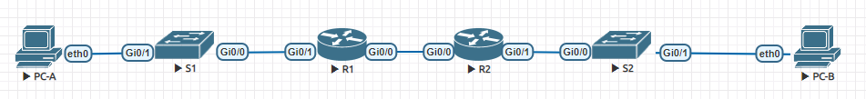

#  Настройка DHCPv4
## Задание:
1. Создание сети и настройка основных параметров устройств
2. Проверка назначения адреса SLAAC от R1
3. Настройка и проверка сервера DHCPv6 без сохранения состояния на R1
4. Настройка и проверка состояния DHCPv6 сервера на R1
5. Настройка и проверка DHCPv6 Relay на R2
## Топология:

## Решение: 
### Создание сети и настройка основных параметров устройств
####  Создадим схему адресации
- Таблица адресации: 


|  				Device 			 |  				Interface 			 |       				IPv6 Address 			      |
|:--------:|:-----------:|:------------------------:|
|  				R1 			     |  				G0/0/0 			    |  				2001:db8:acad:2::1 /64 			 |
|  				R1 			     |  				G0/0/0 			    |  				fe80::1 			                |
|  				R1 			     |  				G0/0/1 			    |  				2001:db8:acad:1::1/64 			  |
|  				R1 			     |  				G0/0/1 			    |  				fe80::1 			                |
|  				R2 			     |  				G0/0/0 			    |  				2001:db8:acad:2::2/64 			  |
|  				R2 			     |  				G0/0/0 			    |  				fe80::2 			                |
|  				R2 			     |  				G0/0/1 			    |  				2001:db8:acad:3::1 /64 			 |
|  				R2 			     |  				G0/0/1 			    |  				fe80::1 			                |
|  				PC-A 			   |  				NIC 			       |  				DHCP 			                   |
|  				PC-B 			   |  				NIC 			       |  				DHCP 			                   |

#### Настроим коммутаторы
- S1
```
Switch>en
Switch#conf t
Switch(config)#host S1
S1(config)#no ip domain-lookup
S1(config)#service password-encryption 
S1(config)#ena sec class
S1(config)#line con 0
S1(config-line)#password cisco
S1(config-line)#logging synchronous 
S1(config-line)#login
S1(config-line)#line vty 0 4
S1(config-line)#password cisco
S1(config-line)#login
S1(config-line)#exit
S1(config)#banner #
Enter TEXT message.  End with the character '#'.
!!!!!!!!!!!!!!!!!!!!!!!!!!!!!!!!!!!!!!!
!!      Only authorized access!      !!   
!!!!!!!!!!!!!!!!!!!!!!!!!!!!!!!!!!!!!!!
#
S1(config)#end
S1#clock set 14:35:00 28 Mar 2021
S1#copy run start
Destination filename [startup-config]? 
Building configuration...
[OK]
S1#
```
- S2
```
Настройки выполнены аналогично
``` 

#### Настроим маршрутизаторы
- R1
```
Router>en
Router#conf t
Router(config)#ipv6 unicast-routing
Router(config)#host R1
R1(config)#no ip domain-lookup
R1(config)#service password-encryption 
R1(config)#ena sec class
R1(config)#line con 0
R1(config-line)#password cisco
R1(config-line)#logging synchronous 
R1(config-line)#login
R1(config-line)#line vty 0 4
R1(config-line)#password cisco
R1(config-line)#login
R1(config-line)#exit
R1(config)#banner #
Enter TEXT message.  End with the character '#'.
!!!!!!!!!!!!!!!!!!!!!!!!!!!!!!!!!!!!!!!
!!      Only authorized access!      !!   
!!!!!!!!!!!!!!!!!!!!!!!!!!!!!!!!!!!!!!!
#
R1(config)#end
R1#clock set 00:05:00 29 Mar 2021
R1#copy run start
Destination filename [startup-config]? 
Building configuration...
[OK]
R1#
```
- R2
```
Настройки выполнены аналогично
``` 
#### Настроим интерфейсы и маршрутизацию для обоих маршрутизаторов
- R1
```
R1(config)#int gi0/0
R1(config-if)#des R2
R1(config-if)#ipv6 address fe80::1 link-local
R1(config-if)#ipv6 address 2001:db8:acad:2::1/64 
R1(config-if)#no shutdown
R1(config-if)#int gi0/1
R1(config-if)#des S1   
R1(config-if)#ipv6 address fe80::1 link-local
R1(config-if)#ipv6 address 2001:db8:acad:1::1/64
R1(config-if)#no shutdown
R1(config-if)#ipv6 route ::/0 2001:DB8:ACAD:2::2
R1(config)#do copy running-config startup-config
Destination filename [startup-config]? 
Building configuration...
[OK]
R1(config)#
```
- R2
```
R2(config)#int gi0/0
R2(config-if)#des R1
R2(config-if)#ipv6 address fe80::1 link-local
R2(config-if)#ipv6 address 2001:db8:acad:2::2/64
R2(config-if)#no shutdown
R2(config-if)#int gi0/1
R2(config-if)#des S2  
R2(config-if)#ipv6 address fe80::1 link-local
R2(config-if)#ipv6 address 2001:db8:acad:3::1/64 
R2(config-if)#no shutdown
R2(config-if)#ipv6 route ::/0 2001:DB8:ACAD:2::1
R2(config)#do copy running-config startup-config
Destination filename [startup-config]? 
Building configuration...
[OK]
R2(config)#
```
#### Проверим работу маршрутизации
```
R1#ping 2001:DB8:ACAD:2::2
Type escape sequence to abort.
Sending 5, 100-byte ICMP Echos to 2001:DB8:ACAD:2::2, timeout is 2 seconds:
!!!!!
Success rate is 100 percent (5/5), round-trip min/avg/max = 1/1/2 ms
R1#
```
