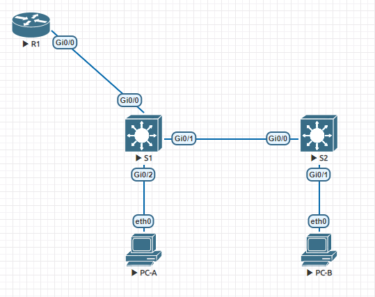

# Настройка Router-on-a-Stick Inter-VLAN Routing

## Задание: 
#Heading 1 link [Heading link](https://github.com/klyuchnikovn/net_eng/blob/master/hw_lesson_2/README.md "Heading link")
  1. Собрать сеть и произвести базовые настройки устройств
  2. Создать VLAN'ы и назначить их на интерфейсы
  3. Настроить trunk'и между коммутаторами
  4. Настроить взаимодействие между VLAN на маршрутизаторе
  5. Проверить всё в работе

## Топология: 


## Решение: 

  1. Задокументируем таблицы адресации и VLAN: 
  
  
  | Device | Interface | IP Address   | Subnet Mask   | Default Gateway |
  |--------|-----------|--------------|---------------|-----------------|
  | R1     | G0/0/1.3  | 192.168.3.1  | 255.255.255.0 | N/A             |
  | R1     | G0/0/1.4  | 192.168.4.1  | 255.255.255.0 | N/A             |
  | R1     | G0/0/1.8  | N/A          | N/A           | N/A             |
  | S1     | VLAN 3    | 192.168.3.11 | 255.255.255.0 | 192.168.3.1     |
  | S2     | VLAN 3    | 192.168.3.12 | 255.255.255.0 | 192.168.3.1     |
  | PC-A   | NIC       | 192.168.3.3  | 255.255.255.0 | 192.168.3.1     |
  | PC-B   | NIC       | 192.168.4.3  | 255.255.255.0 | 192.168.4.1     |


```
Router>en    
Router#conf t
Router(config)# hos R1
R1(config)#no ip domain-lookup 
R1(config)#service password-encryption 
R1(config)#enab sec cisco
R1(config)#line con 0
R1(config-line)#password cisco
R1(config-line)#exit
R1(config)#usern cisco sec cisco
R1(config)#banner exec $ 
Enter TEXT message.  End with the character '$'.
***************************************
* Unauthorized access is prohibited!  *
***************************************
$
R1(config)#banner incoming $
Enter TEXT message.  End with the character '$'.
***************************************
* Unauthorized access is prohibited!  *
***************************************
$
R1(config)#banner login $
Enter TEXT message.  End with the character '$'.
***************************************
* Unauthorized access is prohibited!  *
***************************************
$
R1(config)#exit
R1#clock set 13:58:00 19 nov 2020 
R1#copy ru st
Destination filename [startup-config]? 
Building configuration...
[OK]
```

  ##Heading link
Коммутаторы S1 и S2 настроены идентично, согласно заданию. 

Настройка PC-A: 

```
VPCS> set pcname PC-A
PC-A> 
PC-A> ip 192.168.3.3/24 192.168.3.1                          
Checking for duplicate address...
PC1 : 192.168.3.3 255.255.255.0 gateway 192.168.3.1
PC-A>
```

Настройка PC-B: 

```
VPCS> set pcname PC-B
PC-B> 
PC-B> ip 192.168.4.3/24 192.168.4.1 
Checking for duplicate address...
PC1 : 192.168.4.3 255.255.255.0 gateway 192.168.4.1
PC-B> 
```

