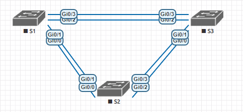
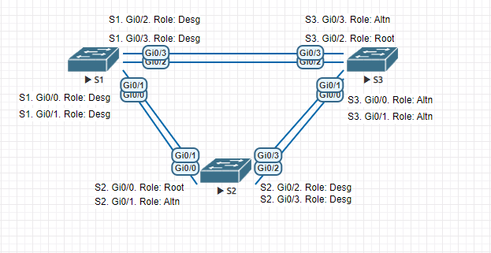

## Настройка коммутируемой сети с резервными каналами

## Задание: 
  1. [Создание сети и предварительная настройка коммутаторов](https://github.com/klyuchnikovn/net_eng/tree/master/hw_lesson_3#%D1%81%D0%BE%D0%B7%D0%B4%D0%B0%D0%BD%D0%B8%D0%B5-%D1%81%D0%B5%D1%82%D0%B8-%D0%B8-%D0%BF%D1%80%D0%B5%D0%B4%D0%B2%D0%B0%D1%80%D0%B8%D1%82%D0%B5%D0%BB%D1%8C%D0%BD%D0%B0%D1%8F-%D0%BD%D0%B0%D1%81%D1%82%D1%80%D0%BE%D0%B9%D0%BA%D0%B0-%D0%BA%D0%BE%D0%BC%D0%BC%D1%83%D1%82%D0%B0%D1%82%D0%BE%D1%80%D0%BE%D0%B2 "Создание сети и предварительная настройка коммутаторов")
  2. [Выбор root bridge](https://github.com/klyuchnikovn/net_eng/tree/master/hw_lesson_3#%D0%B2%D1%8B%D0%B1%D0%BE%D1%80-root-bridge "Выбор root bridge")
  3. [Наблюдение за процессом выбора протоколом STP порта, исходя из стоимости портов](https://github.com/klyuchnikovn/net_eng/tree/master/hw_lesson_3#%D0%BD%D0%B0%D0%B1%D0%BB%D1%8E%D0%B4%D0%B5%D0%BD%D0%B8%D0%B5-%D0%B7%D0%B0-%D0%BF%D1%80%D0%BE%D1%86%D0%B5%D1%81%D1%81%D0%BE%D0%BC-%D0%B2%D1%8B%D0%B1%D0%BE%D1%80%D0%B0-%D0%BF%D1%80%D0%BE%D1%82%D0%BE%D0%BA%D0%BE%D0%BB%D0%BE%D0%BC-stp-%D0%BF%D0%BE%D1%80%D1%82%D0%B0-%D0%B8%D1%81%D1%85%D0%BE%D0%B4%D1%8F-%D0%B8%D0%B7-%D1%81%D1%82%D0%BE%D0%B8%D0%BC%D0%BE%D1%81%D1%82%D0%B8-%D0%BF%D0%BE%D1%80%D1%82%D0%BE%D0%B2 "Наблюдение за процессом выбора протоколом STP порта, исходя из стоимости портов")
  4. [Наблюдение за процессом выбора протоколом STP порта, исходя из приоритета портов](https://github.com/klyuchnikovn/net_eng/tree/master/hw_lesson_3#%D0%BD%D0%B0%D0%B1%D0%BB%D1%8E%D0%B4%D0%B5%D0%BD%D0%B8%D0%B5-%D0%B7%D0%B0-%D0%BF%D1%80%D0%BE%D1%86%D0%B5%D1%81%D1%81%D0%BE%D0%BC-%D0%B2%D1%8B%D0%B1%D0%BE%D1%80%D0%B0-%D0%BF%D1%80%D0%BE%D1%82%D0%BE%D0%BA%D0%BE%D0%BB%D0%BE%D0%BC-stp-%D0%BF%D0%BE%D1%80%D1%82%D0%B0-%D0%B8%D1%81%D1%85%D0%BE%D0%B4%D1%8F-%D0%B8%D0%B7-%D0%BF%D1%80%D0%B8%D0%BE%D1%80%D0%B8%D1%82%D0%B5%D1%82%D0%B0-%D0%BF%D0%BE%D1%80%D1%82%D0%BE%D0%B2 "Наблюдение за процессом выбора протоколом STP порта, исходя из приоритета портов")

## Топология: 


## Решение: 

### Создание сети и предварительная настройка коммутаторов

#### Заполнение таблицы адресации

- Таблица адресации: 

  |     Устройство    |     Интерфейс    |     IP-адрес       |     Маска подсети    |
  |-------------------|------------------|--------------------|----------------------|
  |     S1            |     VLAN 1       |     192.168.1.1    |     255.255.255.0    |
  |     S2            |     VLAN 1       |     192.168.1.2    |     255.255.255.0    |
  |     S3            |     VLAN 1       |     192.168.1.3    |     255.255.255.0    |

#### Настройка коммутаторов

- S1

```
Switch#conf t
Switch(config)#no ip domain-look 
Switch(config)#serv password-encryption 
Switch(config)#host S1
S1(config)#ena sec class
S1(config)#line con 0
S1(config-line)#password cisco
S1(config-line)#logging synchronous 
S1(config-line)#line vty 0 4
S1(config-line)#password cisco
S1(config-line)#exit
S1(config)#banner #
Enter TEXT message.  End with the character '#'.
!!!!!!!!!!!!!!!!!!!!!!!!!!!!!!!!!!!!!!!
!!      Only authorized access!      !!   
!!!!!!!!!!!!!!!!!!!!!!!!!!!!!!!!!!!!!!!
#
S1(config)#int vl1
S1(config-if)#ip add 192.168.1.1 255.255.255.0
S1(config-if)#no sh
S1(config-if)#^Z
S1#copy run st
```

- S2 и S3

```
Настройки выполнены аналогично, согласно таблицы адресации
```

### Выбор root bridge

- Отключение всех интерфейсов на S1, S2, S3 (на примере S1): 

```
S1(config)#int ra gi0/0-3,gi1/0-3
S1(config-if-range)#shut
```

- Соединение коммутаторов одним линком на S1, S2, S3 (на примере S1): 

```
S1(config)#int ran gi0/0,gi0/2
S1(config-if-range)#no sh
S1(config-if-range)#sw trunk encapsulation dot1q 
S1(config-if-range)#sw m t
```


- Просмотр STP на S1

```
S1#show spanning-tree 

VLAN0001
  Spanning tree enabled protocol rstp
  Root ID    Priority    32769
             Address     5000.0001.0000
             This bridge is the root
             Hello Time   2 sec  Max Age 20 sec  Forward Delay 15 sec

  Bridge ID  Priority    32769  (priority 32768 sys-id-ext 1)
             Address     5000.0001.0000
             Hello Time   2 sec  Max Age 20 sec  Forward Delay 15 sec
             Aging Time  300 sec

Interface           Role Sts Cost      Prio.Nbr Type
------------------- ---- --- --------- -------- --------------------------------
Gi0/0               Desg FWD 4         128.1    Shr 
Gi0/2               Desg FWD 4         128.3    Shr 
```

- Просмотр STP на S2

```
S2#show spanning-tree 

VLAN0001
  Spanning tree enabled protocol rstp
  Root ID    Priority    32769
             Address     5000.0001.0000
             Cost        4
             Port        1 (GigabitEthernet0/0)
             Hello Time   2 sec  Max Age 20 sec  Forward Delay 15 sec

  Bridge ID  Priority    32769  (priority 32768 sys-id-ext 1)
             Address     5000.0002.0000
             Hello Time   2 sec  Max Age 20 sec  Forward Delay 15 sec
             Aging Time  300 sec

Interface           Role Sts Cost      Prio.Nbr Type
------------------- ---- --- --------- -------- --------------------------------
Gi0/0               Root FWD 4         128.1    Shr 
Gi0/2               Desg FWD 4         128.3    Shr 
```

- Просмотр STP на S3

```
S3#show spanning-tree 

VLAN0001
  Spanning tree enabled protocol rstp
  Root ID    Priority    32769
             Address     5000.0001.0000
             Cost        4
             Port        3 (GigabitEthernet0/2)
             Hello Time   2 sec  Max Age 20 sec  Forward Delay 15 sec

  Bridge ID  Priority    32769  (priority 32768 sys-id-ext 1)
             Address     5000.0003.0000
             Hello Time   2 sec  Max Age 20 sec  Forward Delay 15 sec
             Aging Time  300 sec

Interface           Role Sts Cost      Prio.Nbr Type
------------------- ---- --- --------- -------- --------------------------------
Gi0/0               Altn BLK 4         128.1    Shr 
Gi0/2               Root FWD 4         128.3    Shr 
```

### Итоговая топология


----
###### Какой коммутатор является корневым мостом?

> S1

###### Почему этот коммутатор был выбран протоколом spanning-tree в качестве root bridge?

> Коммутатор S1 имеет наименьший адрес: 5000.0001.0000

###### Какие порты на коммутаторах являются root портами?

> S1: нет; S2: Gi0/0; S3: Gi0/2

###### Какие порты на коммутаторах являются designated  портами?

> S1: Gi0/1, Gi0/2; S2: Gi0/2; S3: нет

###### Какой порт отображается в качестве альтернативного и в настоящее время заблокирован? 

> S3: Gi0/0

###### Почему протокол spanning-tree выбрал этот порт в качестве заблокированного?

> В выборе между S2 Gi0/2 и S3 Gi0/0 у S3 Gi0/0 оказался наименьший приоритет
----

### Наблюдение за процессом выбора протоколом STP порта, исходя из стоимости портов

#### Изменение стоимости порта

- Проверяем текущую стоимость портов

```
S3#sh sp

VLAN0001
  Spanning tree enabled protocol rstp
  Root ID    Priority    32769
             Address     5000.0001.0000
             Cost        4
             Port        3 (GigabitEthernet0/2)
             Hello Time   2 sec  Max Age 20 sec  Forward Delay 15 sec

  Bridge ID  Priority    32769  (priority 32768 sys-id-ext 1)
             Address     5000.0003.0000
             Hello Time   2 sec  Max Age 20 sec  Forward Delay 15 sec
             Aging Time  300 sec

Interface           Role Sts Cost      Prio.Nbr Type
------------------- ---- --- --------- -------- --------------------------------
Gi0/0               Altn BLK 4         128.1    Shr 
Gi0/2               Root FWD 4         128.3    Shr 
```

- Изменение стоимости

```
S3#conf t
Enter configuration commands, one per line.  End with CNTL/Z.
S3(config)#int gi0/2
S3(config-if)#spa
S3(config-if)#spanning-tree co
S3(config-if)#spanning-tree cost 18
```

- Просмотр изменений

```
S3#sh spanning-tree 
*Nov 24 20:21:46.638: %SYS-5-CONFIG_I: Configured from console by console
S3#sh sp            

VLAN0001
  Spanning tree enabled protocol rstp
  Root ID    Priority    32769
             Address     5000.0001.0000
             Cost        8
             Port        1 (GigabitEthernet0/0)
             Hello Time   2 sec  Max Age 20 sec  Forward Delay 15 sec

  Bridge ID  Priority    32769  (priority 32768 sys-id-ext 1)
             Address     5000.0003.0000
             Hello Time   2 sec  Max Age 20 sec  Forward Delay 15 sec
             Aging Time  300 sec

Interface           Role Sts Cost      Prio.Nbr Type
------------------- ---- --- --------- -------- --------------------------------
Gi0/0               Root FWD 4         128.1    Shr 
Gi0/2               Altn BLK 18        128.3    Shr 
```

----
###### Почему протокол spanning-tree заменяет ранее заблокированный порт на назначенный порт и блокирует порт, который был назначенным портом на другом коммутаторе?

> Потому что ранее стоимость была одинаковой, а теперь появился порт с большей стоимостью
----

- Возвращаем настройки обратно

```
S3(config)#int gi0/2
S3(config-if)#no spanning-tree cost 18
```

- Проверяем текущую стоимость портов

```
S3#
*Nov 24 20:23:46.255: %SYS-5-CONFIG_I: Configured from console by console
S3#sh sp 

VLAN0001
  Spanning tree enabled protocol rstp
  Root ID    Priority    32769
             Address     5000.0001.0000
             Cost        4
             Port        3 (GigabitEthernet0/2)
             Hello Time   2 sec  Max Age 20 sec  Forward Delay 15 sec

  Bridge ID  Priority    32769  (priority 32768 sys-id-ext 1)
             Address     5000.0003.0000
             Hello Time   2 sec  Max Age 20 sec  Forward Delay 15 sec
             Aging Time  300 sec

Interface           Role Sts Cost      Prio.Nbr Type
------------------- ---- --- --------- -------- --------------------------------
Gi0/0               Altn BLK 4         128.1    Shr 
Gi0/2               Root FWD 4         128.3    Shr 
```

### Наблюдение за процессом выбора протоколом STP порта, исходя из приоритета портов

#### Соединение коммутаторов ещё одним линком линком на S1, S2, S3 (на примере S1): 

```
S1(config)#int ra gi0/1,gi0/3
S1(config-if-range)#no sh
S1(config-if-range)#sw trunk encapsulation dot1q
S1(config-if-range)#sw m t
```

- Просмотр STP на S1

```
S1#sh sp

VLAN0001
  Spanning tree enabled protocol rstp
  Root ID    Priority    32769
             Address     5000.0001.0000
             This bridge is the root
             Hello Time   2 sec  Max Age 20 sec  Forward Delay 15 sec

  Bridge ID  Priority    32769  (priority 32768 sys-id-ext 1)
             Address     5000.0001.0000
             Hello Time   2 sec  Max Age 20 sec  Forward Delay 15 sec
             Aging Time  300 sec

Interface           Role Sts Cost      Prio.Nbr Type
------------------- ---- --- --------- -------- --------------------------------
Gi0/0               Desg FWD 4         128.1    Shr 
Gi0/1               Desg FWD 4         128.2    Shr 
Gi0/2               Desg FWD 4         128.3    Shr 
Gi0/3               Desg FWD 4         128.4    Shr 
```

- Просмотр STP на S2

```
S2#sh sp

VLAN0001
  Spanning tree enabled protocol rstp
  Root ID    Priority    32769
             Address     5000.0001.0000
             Cost        4
             Port        1 (GigabitEthernet0/0)
             Hello Time   2 sec  Max Age 20 sec  Forward Delay 15 sec

  Bridge ID  Priority    32769  (priority 32768 sys-id-ext 1)
             Address     5000.0002.0000
             Hello Time   2 sec  Max Age 20 sec  Forward Delay 15 sec
             Aging Time  300 sec

Interface           Role Sts Cost      Prio.Nbr Type
------------------- ---- --- --------- -------- --------------------------------
Gi0/0               Root FWD 4         128.1    Shr 
Gi0/1               Altn BLK 4         128.2    Shr 
Gi0/2               Desg FWD 4         128.3    Shr 
Gi0/3               Desg FWD 4         128.4    Shr 
```

- Просмотр STP на S3

```
S3#sh sp

VLAN0001
  Spanning tree enabled protocol rstp
  Root ID    Priority    32769
             Address     5000.0001.0000
             Cost        4
             Port        3 (GigabitEthernet0/2)
             Hello Time   2 sec  Max Age 20 sec  Forward Delay 15 sec

  Bridge ID  Priority    32769  (priority 32768 sys-id-ext 1)
             Address     5000.0003.0000
             Hello Time   2 sec  Max Age 20 sec  Forward Delay 15 sec
             Aging Time  300 sec

Interface           Role Sts Cost      Prio.Nbr Type
------------------- ---- --- --------- -------- --------------------------------
Gi0/0               Altn BLK 4         128.1    Shr 
Gi0/1               Altn BLK 4         128.2    Shr 
Gi0/2               Root FWD 4         128.3    Shr 
Gi0/3               Altn BLK 4         128.4    Shr 
```

### Итоговая топология



----

###### Какой порт выбран протоколом STP в качестве порта корневого моста на каждом коммутаторе некорневого моста?

> S2: Gi0/0; S3: Gi0/2

###### Почему протокол STP выбрал эти порты в качестве портов корневого моста на этих коммутаторах?

> У них наименьший приоритет и кратчайший путь до root bridge

###### Какое значение протокол STP использует первым после выбора root bridge, чтобы определить выбор порта?

> Root Path Cost

###### Если первое значение на двух портах одинаково, какое следующее значение будет использовать протокол STP при выборе порта?

> Выбирается меньший Bridge ID коммутатора

###### Если оба значения на двух портах равны, каким будет следующее значение, которое использует протокол STP при выборе порта?

> Выбирается на основе Port ID

----

## Готово
Все конфиги хранятся [здесь](configs/).